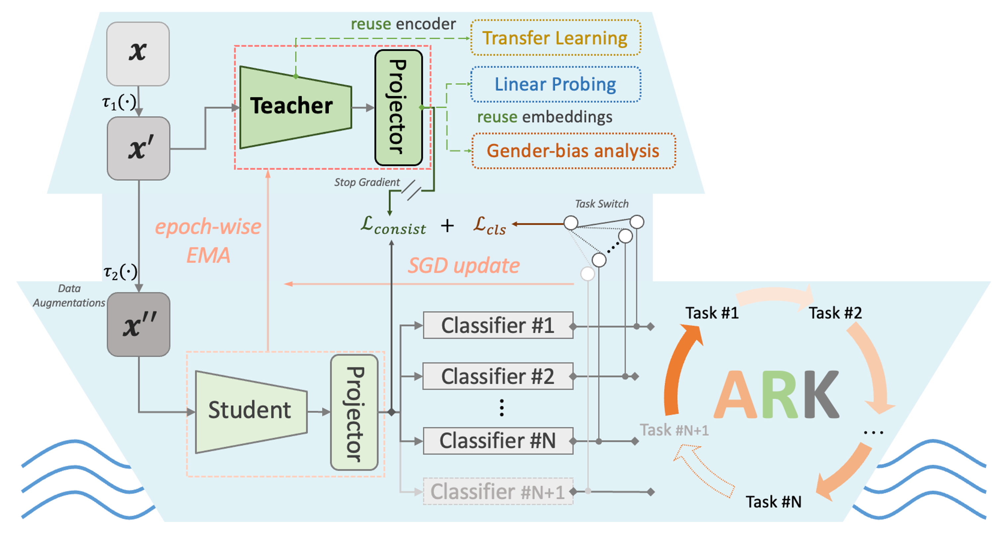
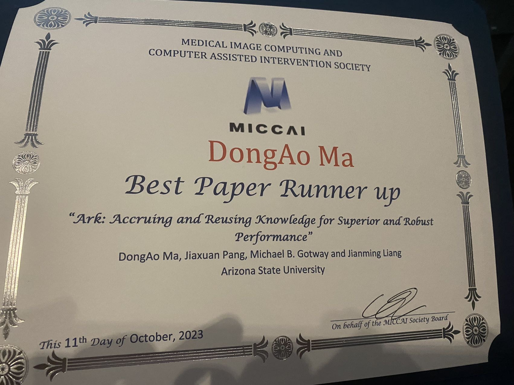

<h1 align="center"><b>Ark: Accruing and Reusing Knowledge</b></h1>

We develop **Open Foundation Models** from numerous public datasets using their heterogeneous expert annotations. 

<p align="center"></p>

## Publication

<b>A Fully Open AI Foundation Model Applied to Chest Radiography </b> <br/>
[DongAo Ma](https://www.linkedin.com/in/dongaoma/)<sup>1</sup>, [Jiaxuan Pang](https://www.linkedin.com/in/jiaxuan-pang-b014ab127/)<sup>1</sup>, [Michael B. Gotway](https://www.mayoclinic.org/biographies/gotway-michael-b-m-d/bio-20055566)<sup>2</sup>, [Jianming Liang](https://chs.asu.edu/jianming-liang)<sup>1</sup><br/>
<sup>1 </sup>Arizona State University, <sup>2 </sup>Mayo Clinic <br/>
<b>*Nature* (2025)</b>

[Paper](https://www.nature.com/articles/s41586-025-09079-8) ([PDF](https://rdcu.be/eqx2i), [Supplementary](https://static-content.springer.com/esm/art%3A10.1038%2Fs41586-025-09079-8/MediaObjects/41586_2025_9079_MOESM1_ESM.pdf), [Peer Review](https://static-content.springer.com/esm/art%3A10.1038%2Fs41586-025-09079-8/MediaObjects/41586_2025_9079_MOESM3_ESM.pdf)) | [Github](https://github.com/jlianglab/Ark/tree/main/Ark_Plus) | [CodeOcean](https://codeocean.com/capsule/8456055/tree) for Reprodicible Run

<b>Ark+: Accruing and Reusing Knowledge from Heterogeneous Labels across Numerous
Datasets for Training Superior and Robust AI Foundation Models </b> 

<b>*Medical Image Analysis* (Accepted, to appear in 2025)</b>


<b>Foundation Ark: Accruing and Reusing Knowledge for Superior and Robust Performance </b> <br/>
[DongAo Ma](https://www.linkedin.com/in/dongaoma/)<sup>1</sup>, [Jiaxuan Pang](https://www.linkedin.com/in/jiaxuan-pang-b014ab127/)<sup>1</sup>, [Michael B. Gotway](https://www.mayoclinic.org/biographies/gotway-michael-b-m-d/bio-20055566)<sup>2</sup>, [Jianming Liang](https://chs.asu.edu/jianming-liang)<sup>1</sup><br/>
<sup>1 </sup>Arizona State University, <sup>2 </sup>Mayo Clinic <br/>
<b>*International Conference on Medical Image Computing and Computer Assisted Intervention ([MICCAI 2023](https://conferences.miccai.org/2023/en/))*</b> (Oral + Poster)

🏆 [Best Paper Award Runner-up](https://miccai.org/index.php/about-miccai/awards/best-paper-award-and-young-scientist-award/)

★ [MICCAI 2023 STAR Awards](https://conferences.miccai.org/2023/en/MICCAI-2023-STudent-Author-Registration-(STAR)-Awards.html)

[Paper](https://link.springer.com/chapter/10.1007/978-3-031-43907-0_62) ([PDF](https://rdcu.be/dnwdJ), [Arxiv](https://arxiv.org/abs/2310.09507)) | [Code](https://github.com/jlianglab/Ark) | [Poster](Ark_MICCAI2023/media/Ark_poster.pdf) | Oral Presentation ([YouTube](https://youtu.be/-gq1Zl-mh60), [BiliBili](https://www.bilibili.com/video/BV1ww411Y7Yv/))

<p align="left"></p>


## Dataset
1. [CheXpert](https://stanfordmlgroup.github.io/competitions/chexpert/)
2. [ChestX-ray14](https://nihcc.app.box.com/v/ChestXray-NIHCC)
3. [RSNA Pneumonia](https://www.kaggle.com/c/rsna-pneumonia-detection-challenge)
4. [VinDrCXR](https://vindr.ai/datasets/cxr)
5. [Shenzhen](https://lhncbc.nlm.nih.gov/LHC-downloads/downloads.html#tuberculosis-image-data-sets)
6. [MIMIC](https://physionet.org/content/mimic-cxr/2.0.0/)


## Pre-trained Ark+ models

You can request the pretrained Ark+ models in our paper throught this [Google Form](https://forms.gle/qkoDGXNiKRPTDdCe8) or [wjx.cn](https://www.wjx.cn/vm/OvwfYFx.aspx#).

An example of initializing the model and loading the pretrained weights can be found at: [Zeroshot Transfer](https://github.com/jlianglab/Ark/blob/main/Ark_Plus/Zeroshot/Ark%2Bzeroshot-pred.ipynb)

### Load pre-trained encoder for downstream tasks 
Create Swin Transformer Base/Large model from the [official model](https://github.com/microsoft/Swin-Transformer/blob/main/models/swin_transformer.py) or from [timm (v0.5.4)](https://github.com/huggingface/pytorch-image-models/tree/main#models).

Below is an example of how to load pre-trained weights into the Swin Transformer model:

```python
import torch
from timm.models.swin_transformer import SwinTransformer

# Initialize the model
model = SwinTransformer(
    num_classes=args.num_class,
    img_size=768,
    patch_size=4,
    window_size=12,
    embed_dim=192,
    depths=(2, 2, 18, 2),
    num_heads=(6, 12, 24, 48)
)

# Load the checkpoint
checkpoint = torch.load('<PATH_TO_MODEL>/Ark6_swinLarge768_ep50.pth.tar', map_location="cpu")
state_dict = checkpoint['teacher']

# Remove "module." prefix if present
state_dict = {k.replace("module.", ""): v for k, v in state_dict.items()}

# Identify and delete unnecessary keys
k_del = [k for k in state_dict.keys() if "attn_mask" in k] + ['head.weight', 'head.bias']
print(f"Removing key(s) {k_del} from pretrained checkpoint for scaled input size")

# Delete identified keys
for k in k_del:
    if k in state_dict:  # Ensure the key exists
        del state_dict[k]

# Load the model weights
msg = model.load_state_dict(state_dict, strict=False)
print('Loaded with msg:', msg)
```

If you encounter a _size mismatch_ error when loading a pretrained model, please verify the version of the timm package, as later versions have updated the Swin Transformer architectures. 


## Citation
If you use this code or use our pre-trained weights for your research, please cite our paper:
```
@article{ma2025fully,
  title={A fully open {AI} foundation model applied to chest radiography},
  author={Ma, DongAo and Pang, Jiaxuan and Gotway, Michael B and Liang, Jianming},
  journal={Nature},
  pages={1--11},
  year={2025},
  publisher={Nature Publishing Group}
}

@InProceedings{ma2023foundation,
    author="Ma, DongAo and Pang, Jiaxuan and Gotway, Michael B. and Liang, Jianming",
    title="Foundation Ark: Accruing and Reusing Knowledge for Superior and Robust Performance",
    booktitle="Medical Image Computing and Computer Assisted Intervention -- MICCAI 2023",
    year="2023",
    publisher="Springer Nature Switzerland",
    address="Cham",
    pages="651--662",
    isbn="978-3-031-43907-0"
}
```

## Acknowledgement
This research has been supported in part by ASU and Mayo Clinic through a Seed Grant and an Innovation Grant, and in part by the NIH under Award Number R01HL128785. The content is solely the responsibility of the authors and does not necessarily represent the official views of the NIH. This work has utilized the GPUs provided in part by the ASU Research Computing and in part by the Bridges-2 at Pittsburgh Supercomputing Center through allocation BCS190015 and the Anvil at Purdue University through allocation MED220025 from the Advanced Cyberinfrastructure Coordination Ecosystem: Services & Support (ACCESS) program, which is supported by National Science Foundation grants #2138259, #2138286, #2138307, #2137603, and #2138296. We also acknowledge Google for granting us access to CXR Foundation API, which enabled us to generate the embeddings for the target datasets. The content of this paper is covered by patents pending.


## License

Released under the [ASU GitHub Project License](./LICENSE).
