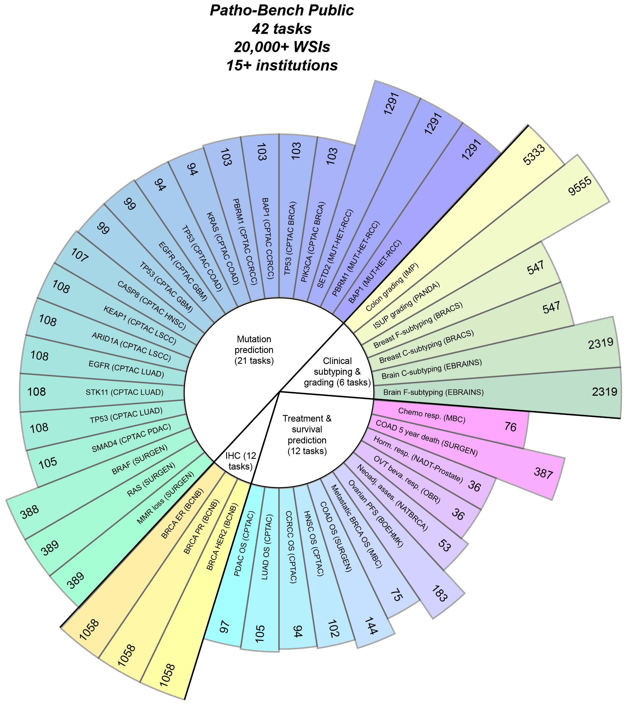

# ♆ Patho-Bench
[📄 Preprint](https://arxiv.org/pdf/2502.06750) | [Code](https://github.com/mahmoodlab/Patho-Bench)



**Patho-Bench is designed to evaluate patch and slide encoder foundation models for whole-slide images (WSIs).** 

This HuggingFace repository contains the data splits for the public Patho-Bench tasks. Please visit our codebase on [GitHub](https://github.com/mahmoodlab/Patho-Bench) for the full codebase and benchmark implementation.

This project was developed by the [Mahmood Lab](https://faisal.ai/) at Harvard Medical School and Brigham and Women's Hospital. This work was funded by NIH NIGMS R35GM138216.

> [!NOTE]
> Contributions are welcome! If you'd like to submit a new dataset and/or task for inclusion in Patho-Bench, please reach out to us via the [Issues](https://github.com/mahmoodlab/Patho-Bench/issues) tab of our Github repo.

Currently, Patho-Bench contains the following task families. We will add more tasks in the future. For further details on each task, please refer to the [THREADS foundation model paper](https://arxiv.org/abs/2501.16652).

| **Family**                           | **Description**                                                                         | **Tasks** | 
|--------------------------------------|---------------------------------------------------------------------------------------|----------|
| **Morphological Subtyping**              | Classifying distinct morphological patterns associated with different disease subtypes | 11        | 
| **TME Characterization**              | Predicting morphological features from the tissue microenvironment (e.g., vascular invasion, necrosis, immune response) | 16        | 
| **Tumor Grading**                        | Assigning a grade based on cellular differentiation and growth patterns               | 9        | 
| **Molecular Subtyping**                  | Predicting antigen presence (e.g., via IHC staining)                                 | 6        | 
| **Mutation Prediction**                  | Predicting specific genetic mutations in tumors                                     | 34       | 
| **Treatment Response & Assessment**      | Evaluating patient response to treatment                                            | 7        | 
| **Survival Prediction**                  | Predicting survival outcomes and risk stratification                                | 12        |
| **Total**                               |                                                                                       | **95**    |

## 🔥 Latest updates
- **April 2025**: Patho-Bench has been updated with 53 new tasks! Now Patho-Bench contains a total of 95 public tasks across 33 datasets.
- **February 2025**: Patho-Bench is now available on HuggingFace.

## ⚡ Installation
Install the required packages:
```
pip install --upgrade datasets
pip install --upgrade huggingface_hub
```

## 🔑 Authentication

```python
from huggingface_hub import login
login(token="YOUR_HUGGINGFACE_TOKEN")
```

## ⬇️ Usage

The Patho-Bench data splits are designed for use with the Patho-Bench [software package](https://github.com/mahmoodlab/Patho-Bench). However, you are welcome to use the data splits in your custom pipeline. Each task is associated with a YAML file containing task metadata and a TSV file containing the sample IDs, slide IDs, and labels.

> [!NOTE]
> Patho-Bench only provides the data splits and labels, NOT the raw image data. You will need to download the raw image data from the respective dataset repositories (see links below).

### Download an individual task
```python
import datasets
dataset='cptac_coad'
task='KRAS_mutation'
datasets.load_dataset(
                    'MahmoodLab/Patho-Bench', 
                    cache_dir='/path/to/saveto',
                    dataset_to_download=dataset,     # Throws error if source not found
                    task_in_dataset=task,            # Throws error if task not found in dataset
                    trust_remote_code=True
                )
```

### Download all tasks from a dataset
```python
import datasets
dataset='cptac_coad'
task='*'
datasets.load_dataset(
                    'MahmoodLab/Patho-Bench', 
                    cache_dir='/path/to/saveto',
                    dataset_to_download=dataset,     
                    task_in_dataset=task,            
                    trust_remote_code=True
                )
```

### Download entire Patho-Bench [4.2 MB]
```python
import datasets
dataset='*'
datasets.load_dataset(
                    'MahmoodLab/Patho-Bench', 
                    cache_dir='/path/to/saveto',
                    dataset_to_download=dataset,
                    trust_remote_code=True
                )
```

## 📢 Image data access links

For each dataset in Patho-Bench, please visit the respective repository below to download the raw image data.

| Dataset | Link |
|---------|------|
| EBRAINS [Roetzer et al., 2022] | [https://doi.org/10.25493/WQ48-ZGX](https://doi.org/10.25493/WQ48-ZGX) |
| BRACS [Brancati et al., 2021] | [https://www.bracs.icar.cnr.it/](https://www.bracs.icar.cnr.it/) |
| PANDA [Bulten et al., 2022] | [https://panda.grand-challenge.org/data/](https://panda.grand-challenge.org/data/) |
| IMP [Neto et al., 2024] | [https://rdm.inesctec.pt/dataset/nis-2023-008](https://rdm.inesctec.pt/dataset/nis-2023-008) |
| BCNB [Xu et al., 2021] | [https://bupt-ai-cz.github.io/BCNB/](https://bupt-ai-cz.github.io/BCNB/) |
| CPTAC-BRCA [Edwards et al., 2015] | [https://www.cancerimagingarchive.net/collection/cptac-brca/](https://www.cancerimagingarchive.net/collection/cptac-brca/) |
| CPTAC-CCRCC [Edwards et al., 2015] | [https://www.cancerimagingarchive.net/collection/cptac-ccrcc/](https://www.cancerimagingarchive.net/collection/cptac-ccrcc/) |
| CPTAC-COAD [Edwards et al., 2015] | [https://www.cancerimagingarchive.net/collection/cptac-coad/](https://www.cancerimagingarchive.net/collection/cptac-coad/) |
| CPTAC-GBM [Edwards et al., 2015] | [https://www.cancerimagingarchive.net/collection/cptac-gbm/](https://www.cancerimagingarchive.net/collection/cptac-gbm/) |
| CPTAC-HNSC [Edwards et al., 2015] | [https://www.cancerimagingarchive.net/collection/cptac-hnsc/](https://www.cancerimagingarchive.net/collection/cptac-hnsc/) |
| CPTAC-LSCC [Edwards et al., 2015] | [https://www.cancerimagingarchive.net/collection/cptac-lscc/](https://www.cancerimagingarchive.net/collection/cptac-lscc/) |
| CPTAC-LUAD [Edwards et al., 2015] | [https://www.cancerimagingarchive.net/collection/cptac-luad/](https://www.cancerimagingarchive.net/collection/cptac-luad/) |
| CPTAC-PDAC [Edwards et al., 2015] | [https://www.cancerimagingarchive.net/collection/cptac-pda/](https://www.cancerimagingarchive.net/collection/cptac-pda/) |
| MUT-HET-RCC | [https://doi.org/10.25452/figshare.plus.c.5983795](https://doi.org/10.25452/figshare.plus.c.5983795) |
| OV-Bevacizumab [Wang et al., 2022] | [https://www.nature.com/articles/s41597-022-01127-6](https://www.nature.com/articles/s41597-022-01127-6) |
| NADT-Prostate [Wilkinson et al., 2021] | [https://www.medrxiv.org/content/10.1101/2020.09.29.20199711v1.full](https://www.medrxiv.org/content/10.1101/2020.09.29.20199711v1.full) |
| POST-NAT-BRCA | [https://onlinelibrary.wiley.com/doi/10.1002/cyto.a.23244](https://onlinelibrary.wiley.com/doi/10.1002/cyto.a.23244) |
| BOEHMK | [https://www.synapse.org/Synapse:syn25946117/wiki/611576](https://www.synapse.org/Synapse:syn25946117/wiki/611576) |
| MBC | [https://www.synapse.org/Synapse:syn59490671/wiki/628046](https://www.synapse.org/Synapse:syn59490671/wiki/628046) |
| SURGEN | [https://www.ebi.ac.uk/biostudies/bioimages/studies/S-BIAD1285](https://www.ebi.ac.uk/biostudies/bioimages/studies/S-BIAD1285) / [arXiv](https://arxiv.org/abs/2502.04946) |
| CPTAC-UCEC | [https://www.cancerimagingarchive.net/collection/cptac-ucec/](https://www.cancerimagingarchive.net/collection/cptac-ucec/) |
| CPTAC-OV | [https://www.cancerimagingarchive.net/collection/cptac-ov/](https://www.cancerimagingarchive.net/collection/cptac-ov/) |
| VisioMel | [https://www.drivendata.org/competitions/148/visiomel-melanoma/](https://www.drivendata.org/competitions/148/visiomel-melanoma/) |
| UCLA Lung | [https://idr.openmicroscopy.org/webclient/?show=project-1251](https://idr.openmicroscopy.org/webclient/?show=project-1251) |
| HER2-Tumor-ROIs | [https://www.cancerimagingarchive.net/collection/her2-tumor-rois/](https://www.cancerimagingarchive.net/collection/her2-tumor-rois/) |
| DHMC LUAD | [https://bmirds.github.io/LungCancer/](https://bmirds.github.io/LungCancer/) |
| DHMC CCRCC | [https://bmirds.github.io/KidneyCancer/](https://bmirds.github.io/KidneyCancer/) |
| Hancock | [https://hancock.research.fau.eu/download](https://hancock.research.fau.eu/download) |
| BC Therapy | [https://zenodo.org/records/6337925\#.Y30d1y-l1Ls](https://zenodo.org/records/6337925\#.Y30d1y-l1Ls) |
| COMET | [https://www.ebi.ac.uk/biostudies/bioimages/studies/S-BIAD1714](https://www.ebi.ac.uk/biostudies/bioimages/studies/S-BIAD1714) |
| Multiscanner | [https://www.ebi.ac.uk/biostudies/bioimages/studies/S-BIAD1343](https://www.ebi.ac.uk/biostudies/bioimages/studies/S-BIAD1343) |
| IMP-Cervical | [https://rdm.inesctec.pt/dataset/nis-2024-003](https://rdm.inesctec.pt/dataset/nis-2024-003) |
| Valentino-CRC, BRAF-CRC | [https://www.ebi.ac.uk/biostudies/bioimages/studies/S-BIAD1407?query=czi](https://www.ebi.ac.uk/biostudies/bioimages/studies/S-BIAD1407?query=czi) |

## 📇 Contact
For any questions, contact:

- Faisal Mahmood (faisalmahmood@bwh.harvard.edu)
- Anurag Vaidya (avaidya@mit.edu)
- Andrew Zhang (andrewzh@mit.edu)
- Guillaume Jaume (gjaume@bwh.harvard.edu)

## 📜 Data description
Developed by: Mahmood Lab AI for Pathology @ Harvard/BWH
Repository: GitHub
License: CC-BY-NC-4.0

## 🤝 Acknowledgements
Patho-Bench tasks were compiled from public image datasets and repositories (linked above). We thank the authors of these datasets for making their data publicly available.

## 📰 How to cite
If Patho-Bench contributes to your research, please cite:

```
@article{vaidya2025molecular,
  title={Molecular-driven Foundation Model for Oncologic Pathology},
  author={Vaidya, Anurag and Zhang, Andrew and Jaume, Guillaume and Song, Andrew H and Ding, Tong and Wagner, Sophia J and Lu, Ming Y and Doucet, Paul and Robertson, Harry and Almagro-Perez, Cristina and others},
  journal={arXiv preprint arXiv:2501.16652},
  year={2025}
}

@article{zhang2025standardizing,
  title={Accelerating Data Processing and Benchmarking of AI Models for Pathology},
  author={Zhang, Andrew and Jaume, Guillaume and Vaidya, Anurag and Ding, Tong and Mahmood, Faisal},
  journal={arXiv preprint arXiv:2502.06750},
  year={2025}
}
```